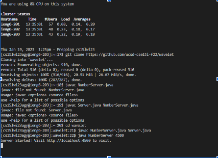

Lab Report 2

The URLHandler Interface

In week2 lab, we analyized the code about the URL by given file called NumberServer.java. Me and my partner write an analyze about each line code which are:

The handle request is to capture the current number of the path and the specific path of the url. If there is “/increment”, the current number will be added 1, and print”increment’. Else, if the url contains”/add”, the url will be splitted with”=”, and return the string type”Number increased by %s! It is now %d, parameter[1]”
If there is not add or path, that will print”404 not found”

And we try to path different ways to get different results on the URL we implements:

Run the Server on a Remote Computer

On this part we connecting the remote computer, compile the file to remote computer and trying to operate the same step about URLHandler on the remote computer,but we have to use different port number

*javac <>.java compile the java file*

*cd - path the director*

I decided to use port of number 4501, here is one of result

After i finished this lab, i found out i may create a website and i'm able to record the number of visitor and by using the interface, they can make commit or upload anything on my website.

Lab report week 3

first we do about running Junit on remote server,if we compile with wrong vision of operation. Error will apear.

Next

I try to deal with the case to let the code fail

Here shows our code is unable to pass the tests case

Conclusion

After i finished week2 and week3, i found out i may create a website and i'm able to record the number of visitor and by using the interface, they can make commit or upload anything on my website. And i also learned how to run Junit on remote server, and trying to find bug and fix it
